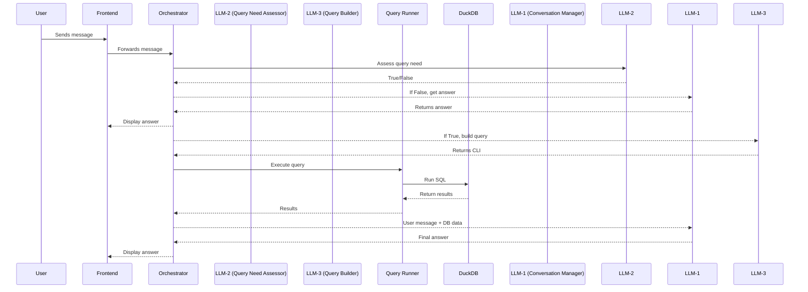

# Agent Demo: Detailed Multi-LLM System Architecture

## 1. System Overview
This architecture enables natural language analytics using three specialized LLM agents, a backend orchestrator, and a DuckDB database. It is designed for reliability, modularity, and extensibility.

---

## 2. Component Breakdown

### 2.1. User Interface (Frontend)
- Chat UI (web, Slack, etc.)
- Sends user messages to backend orchestrator
- Displays responses from LLM-1

### 2.2. Backend Orchestrator
- Central logic hub
- Receives user messages
- Maintains conversation state
- Routes messages to LLM-2, LLM-3, and LLM-1 as needed
- Handles query execution and result aggregation
- Implements fallback logic if LLM-3 is unreliable

### 2.3. LLM Agents

#### LLM-1: Conversation Manager
- Receives messages only after LLM-2 assessment
- If no query is needed, answers directly
- If query is needed, receives both user message and database data
- Summarizes and responds to user

#### LLM-2: Query Need Assessor
- Lightweight, fast LLM
- Receives every user message first
- Returns Boolean: `True` (query needed) or `False` (no query needed)

#### LLM-3: Query Builder
- More powerful, expensive LLM
- Activated only if LLM-2 returns `True`
- Parses user intent, extracts metrics, timeframes, filters
- Generates CLI instructions for query execution
- Example output: CLI command for `gigachad_query.py`
- Must be tested for reliability; fallback to `/helpers` if needed

### 2.4. Query Runner
- Executes CLI instructions from LLM-3
- Uses Python subprocess
- Returns results as JSON/text

### 2.5. Database (DuckDB)
- Stores ads analytics data
- Responds to queries from Query Runner

---

## 3. Message Routing Logic (Detailed)

1. **User sends message via UI.**
2. **Backend Orchestrator forwards message to LLM-2.**
   - LLM-2 returns `False`: Orchestrator sends message to LLM-1 for direct answer.
   - LLM-2 returns `True`: Orchestrator sends message to LLM-3 for query building.
3. **If query is needed:**
   - LLM-3 generates CLI instructions.
   - Orchestrator executes query via Query Runner.
   - Database returns results.
   - Orchestrator sends both user message and database results to LLM-1:
     ```
     Message from user: "last_message"
     Data from the database for you to answer that question: "query_response"
     ```
   - LLM-1 summarizes and responds to user.

---

## 4. Example Prompts & Outputs

### LLM-2 Prompt Example
```
User message: "Compare CAC and ROAS for last 30 days vs prior 30 days."
Does this require a database query? (Return True or False)
```

### LLM-3 Prompt Example
```
User message: "Compare CAC and ROAS for last 30 days vs prior 30 days."
Extract metrics, timeframes, and generate CLI command for gigachad_query.py.
```
Output:
```
python helpers/gigachad_query.py --start 2025-07-28 --end 2025-08-27 --metric cac
python helpers/gigachad_query.py --start 2025-07-28 --end 2025-08-27 --metric roas
python helpers/gigachad_query.py --start 2025-06-28 --end 2025-07-27 --metric cac
python helpers/gigachad_query.py --start 2025-06-28 --end 2025-07-27 --metric roas
```

### LLM-1 Prompt Example (when query is needed)
```
Message from user: "Compare CAC and ROAS for last 30 days vs prior 30 days."
Data from the database for you to answer that question: "{ 'last_30_days': { 'cac': 123.45, 'roas': 2.34 }, 'prior_30_days': { 'cac': 130.12, 'roas': 2.10 } }"
Summarize and compare these metrics for the user.
```

---

## 5. Reliability & Fallback Strategy

- **LLM-3 must be tested for reliability.**
  - If LLM-3 fails to generate correct queries, fallback to `/helpers` scripts (e.g., `gigachad_query.py`).
  - This ensures robust, maintainable, and accurate analytics responses.

---

## 6. Extensibility & Maintenance

- Add more metrics, filters, and groupings to `/helpers` as needed.
- Modularize backend logic for easy agent replacement or upgrade.
- Log all agent decisions and query results for debugging and improvement.
- Optionally, add monitoring for LLM-3 reliability and auto-switch to fallback.

---

## 7. Sequence Diagram (Expanded)



---

## 8. Summary Table

| Component               | Role/Responsibility                                 |
|------------------------ |----------------------------------------------------|
| Frontend                | User interface, message relay                       |
| Orchestrator            | Routing, state, fallback, aggregation               |
| LLM-2: Query Need Assessor | Returns True/False if query is needed           |
| LLM-3: Query Builder    | Generates CLI for gigachad_query.py             |
| Query Runner            | Executes query, returns results                      |
| DuckDB                  | Database backend                                   |
| LLM-1: Conversation Manager | Summarizes and responds to user                |

---

## 9. Fallback Example

If LLM-3 is unreliable:
- Orchestrator uses `/helpers/gigachad_query.py` directly for query logic.
- Ensures consistent, correct results for analytics questions.

---

## 10. Maintenance Checklist
- Test LLM-3 regularly for query accuracy
- Log all agent decisions and query results
- Update `/helpers` scripts as metrics evolve
- Monitor system for errors and fallback triggers

---

For further details, see the main README in this folder.
